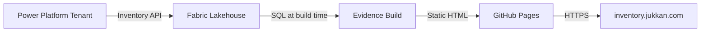
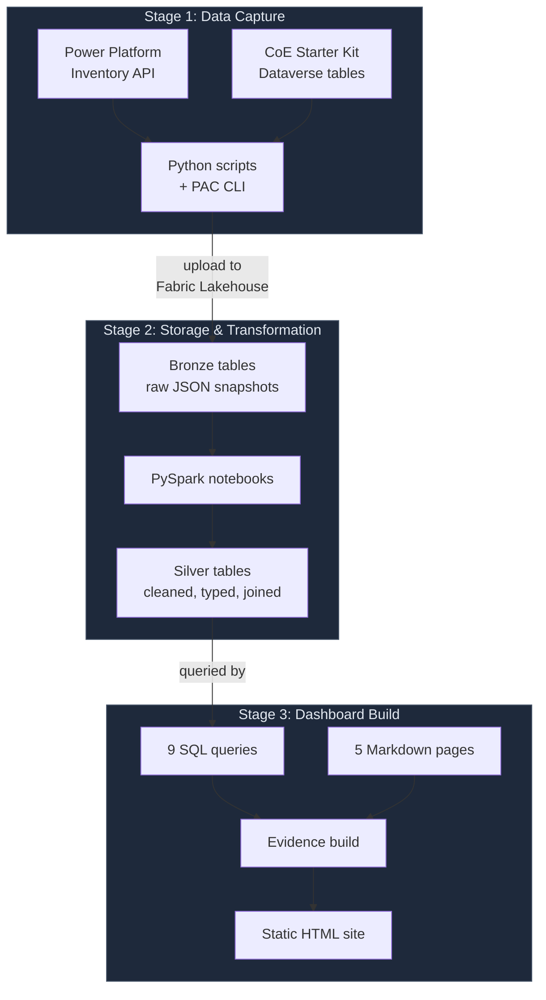
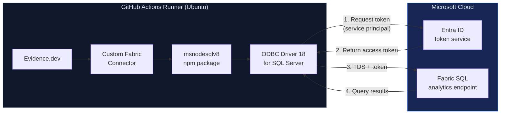
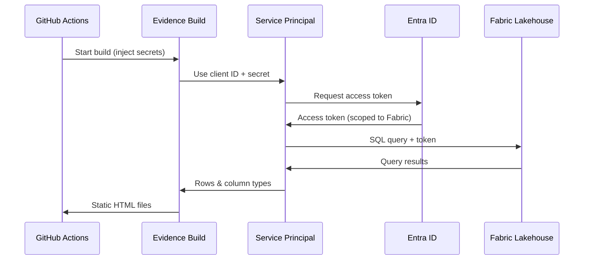
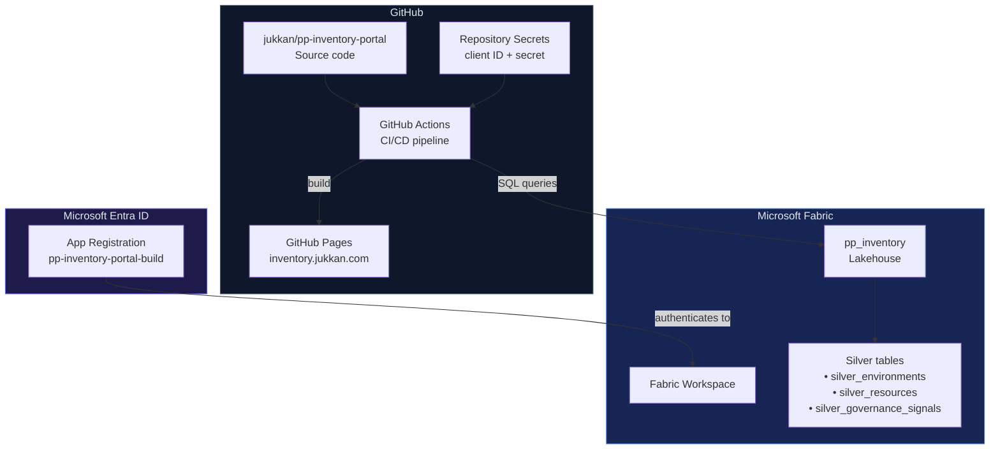
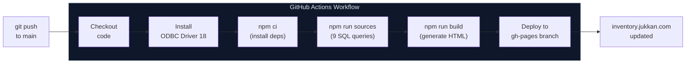

# Architecture

This document explains how the PP Inventory Portal works, from data to deployed website.

## The big picture

The portal is a **static website** that displays governance data about a Power Platform tenant. "Static" means the site is plain HTML/CSS/JS files served from GitHub Pages — there is no server processing requests when someone visits the page.

The data comes from a **Microsoft Fabric Lakehouse**, which is a cloud database. SQL queries run against this database once at build time, and the results are baked into the HTML. The site never contacts the database when a visitor loads it.



## Data flow in detail

Data flows through three stages. Each stage runs independently — if one breaks, the others continue with the last good data.



## How the build connects to Fabric

The trickiest part of this project is the database connection. Here's the chain:



**Why this chain exists:** Evidence normally uses a JavaScript library called `tedious` to talk to SQL Server. Tedious cannot connect to Fabric — it fails during the login handshake. So this project uses a custom connector that delegates to Microsoft's native ODBC driver instead, which handles Fabric authentication correctly.

## Authentication



The service principal is an app registration in Microsoft Entra ID (formerly Azure AD). It has **Viewer** access to the Fabric workspace — read-only, it cannot modify data. Its credentials are stored as GitHub Actions secrets, never in code.

## Where things live



## The connector explained

Evidence uses a plugin system for database connections. Each plugin is a small npm package that implements three functions:

| Function | Purpose |
|---|---|
| `runQuery(sql, options)` | Execute a SQL string and return rows + column types |
| `testConnection(options)` | Verify the connection works (used by Evidence CLI) |
| `getRunner(options)` | Return a function that runs `.sql` files one at a time |

The custom Fabric connector (`packages/fabric-connector/index.cjs`) implements these three functions using `msnodesqlv8`. It builds an ODBC connection string like:

```
Driver={ODBC Driver 18 for SQL Server};
Server=<fabric-endpoint>;
Database=pp_inventory;
Encrypt=yes;
Authentication=ActiveDirectoryServicePrincipal;
UID=<client-id>;
PWD=<client-secret>
```

The ODBC driver handles all the complexity: TLS negotiation, Entra ID token acquisition, TDS protocol framing. The connector just passes through the SQL and maps the results to Evidence's type system.

## Build pipeline



The workflow also runs on `workflow_dispatch`, so you can trigger a data refresh from the GitHub Actions UI without pushing a code change.
